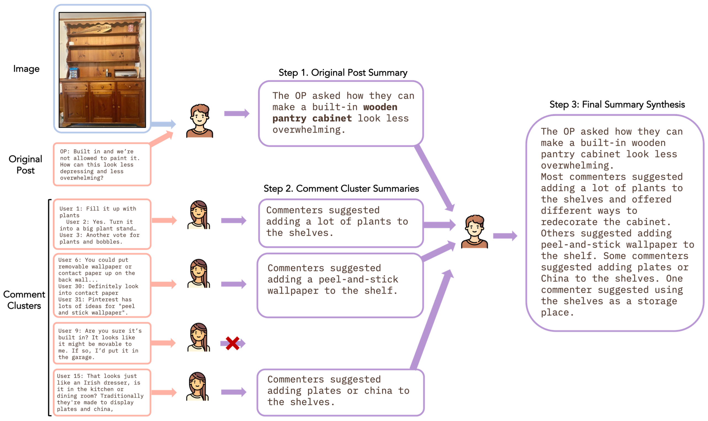

# mRedditSum

Welcome! 👋🏻\
This is the official repository of our EMNLP 2023 paper: \
**[mRedditSum: A Multimodal Abstractive Summarization Dataset of Reddit Threads with Images.](https://openreview.net/forum?id=k3i6PKlKY8)**



Please cite our work if you found the resources in this repository useful:

```bib
@inproceedings{overbay2023mredditsum,
    title={mRedditSum: A Multimodal Abstractive Summarization Dataset of Reddit Threads with Images.},
    author={Keighley Overbay and Jaewoo Ahn and Fatemeh Pesaran Zadeh and Joonsuk Park and Gunhee Kim},
    booktitle={EMNLP},
    year=2023
}
```

## Dataset

You can download our mRedditSum dataset directly by clicking this [link](https://drive.google.com/file/d/1WhOgsEWmLSnEG2-K8R2n_hogFLGPkI8I/view?usp=sharing).

The data comes preprocessed and ready for training.

## Model training

To reproduce the results of our paper, you can run the models as follows.

To run the models, use run.py under the src file.

### Text-only models

Example of running regular text-only BART:

```
python src/run.py \
        -model=text_only_bart \
        -train_src_path=../data/train_processed_src.txt \
        -train_tgt_path=../data/train_processed_tgt.txt \
        -val_src_path=../data/val_processed_src.txt \
        -val_tgt_path=../data/val_processed_tgt.txt \
        -test_src_path=../data/test_processed_src.txt \
        -test_tgt_path=../data/test_processed_tgt.txt \
        -val_save_file=../results/val/bart_val.txt \
        -test_save_file=../results/test/bart_test.txt \
        -log_name=text_only_bart \
        -gpus='1' \
        -batch_size=4 \
        -learning_rate=3e-5 \
        -scheduler_lambda1=10 \
        -scheduler_lambda2=0.95 \
        -num_epochs=50 \
        -grad_accumulate=5 \
        -max_input_len=1024 \
        -max_output_len=256 \
        -n_beams=5 \
        -random_seed=0 \
        -do_train=True \
        -do_test=False \
        -limit_val_batches=1 \
        -val_check_interval=1 \
        -img_lr_factor=5 \
        -checkpoint=None
```

See the run.py file for more notes on input arguments.

### ClusMulSum models

For running the ClusMulSum model, there are a few more steps. Run the following:
TO BE UPDATED SHORTLY...
